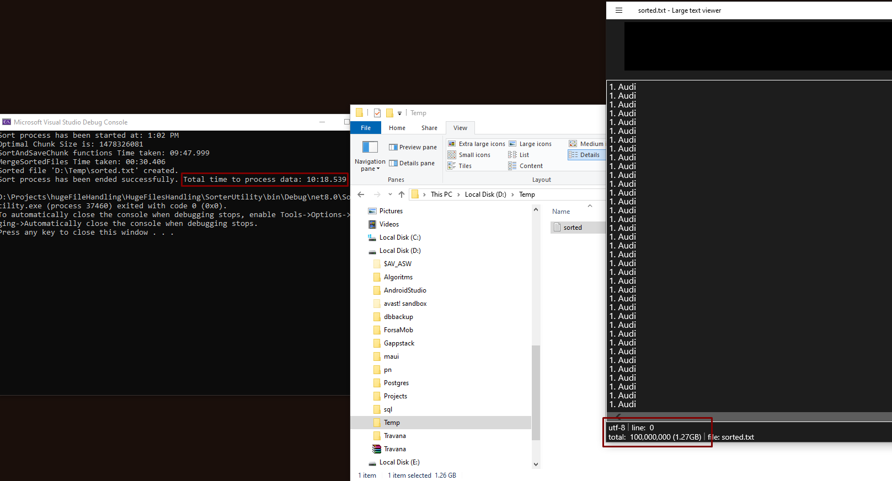

Given.

The input is a large text file, where each line is a Number. String
For example:
415. Apple
30432. Something something something
1. Apple
32. Cherry is the best
2. Banana is yellow

Task description.

Both parts can be repeated within the file. You need to get another file as output, where all
the lines are sorted. Sorting criteria: String part is compared first, if it matches then
Number.
Those in the example above, it should be:
1. Apple
415. Apple
2. Banana is yellow
32. Cherry is the best
30432. Something something something

You need to write two programs:
1. A utility for creating a test file of a given size. The result of the work should be a text file
of the type described above. There must be some number of lines with the same String
part.
2. The actual sorter. An important point, the file can be very large. The size of ~100Gb will
be used for testing.
When evaluating the completed task, we will first look at the result (correctness of
generation / sorting and running time), and secondly, at how the candidate writes the code.
Programming language: C#.

Repository description.

The repository contains 2 programs: 
1. Creates a text file with the specified name, location and with the specified number of lines.
2. Sorts the input text file in the specified way and generates a new sorted file at the output.

Some test outputs for the test file 1.3 GB:

How to video instruction link:

https://www.loom.com/share/7b2a9ad8d8e54744b75f895606e4a047

Solution:

As we have some given inputs from the initial task so that input files can have the huge size (100 GB), it's obvious 
we can't just read all file lines into RAM and manipulate it.

To solve this task I decided to read input file data by some portions (chunks) and get the size of the chunk based on current PC available memory.

Once we get chunk we order the data inside and create temporary file. Once all temporary files are created I use multi-way merge alghoritm
which is combine all sorted temporary files into one final sorted out.

Finaly I delete all the temporary files. 

I've tested the solution on My local PC:

System Manufacturer:       Gigabyte Technology Co., Ltd.
System Model:              Z370 HD3P
OS Name:                   Microsoft Windows 10 Pro
Processor(s):              1 Processor(s) Installed.
                           [01]: Intel64 Family 6 Model 158 Stepping 10 GenuineIntel ~3601 Mhz
Total Physical Memory:     32,714 MB

The input *txt file ~1.3GB was handled in about 14 minutes which is not great but it is what it is :)